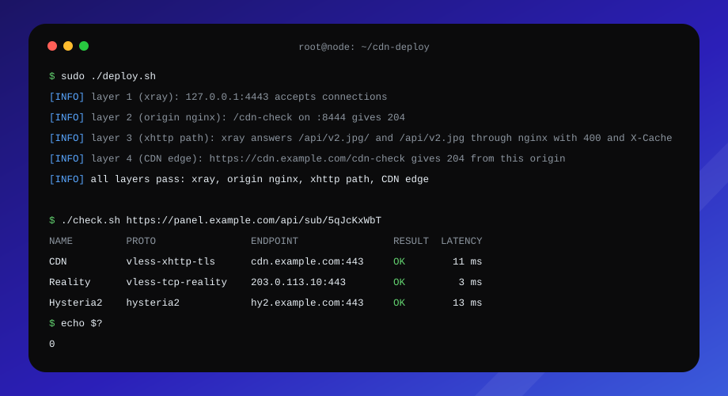

<p align="center"></p>

<h1 align="center">xhttp-cdn-node</h1>

<p align="center"><b>Нода Remnawave за CDN одной командой.</b><br />
На новом сервере или рядом с уже работающими VLESS и Hysteria2: nginx, сертификаты и тюнинг ядра на origin, проверка всей цепочки до CDN и чекер каждого сервера подписки.</p>

<p align="center"></p>

<p align="center">
  <a href="#что-нужно-заранее"></a>
  <a href="#что-нужно-заранее"></a>
  <a href="#чекер-подписки"></a>
  <a href="#ресурс-timeweb-cdn"></a>
  <a href="#разработка"></a>
</p>

<p align="center">
  <a href="#установка">Установка</a> ·
  <a href="#что-делает">Что делает</a> ·
  <a href="#шаг-в-панели-remnawave">Панель</a> ·
  <a href="#проверка-после-установки">Проверка</a> ·
  <a href="#чекер-подписки">Чекер</a> ·
  <a href="#как-это-работает">Как это работает</a> ·
  <a href="#подводные-камни">Подводные камни</a>
</p>

---

## Установка

Одна команда. Ubuntu 22.04/24.04 или Debian 12, root:

```sh
git clone https://github.com/MarselNet86/xhttp-cdn-node.git && cd xhttp-cdn-node && sudo ./deploy.sh
```

Скрипт спросит домены и порты, поставит пакеты, выпустит сертификаты Let's Encrypt, настроит ядро и nginx. Потом он выдаст конфиги для панели в `out/remnawave/` и проведёт по ней: сначала профиль, затем нода с этим профилем. В конце он проверит цепочку до CDN. Ответы он сохранит в `.env` с правами 600: там токен Cloudflare.

> [!TIP]
> Сначала посмотрите план: `sudo ./deploy.sh --dry-run` печатает настройки и шаги и ничего не меняет.

> [!IMPORTANT]
> Скрипт запускается до того, как нода появится в панели. Мастер «Создать ноду» на последнем шаге требует профиль, а профиль выдаёт скрипт. Ноду создавайте по [шагу 2 в панели](#шаг-в-панели-remnawave): к этому моменту сертификаты и тюнинг ядра уже на месте, и нода сразу стартует с ними.

**Повторный запуск безопасен.** Значения из `.env` становятся дефолтами, неизменённые файлы не перезаписываются, валидные сертификаты не перевыпускаются. Ручные правки в `/etc/nginx` затираются, поэтому меняйте шаблоны в `templates/`.

**Без вопросов.** Заполните `.env` по образцу [.env.example](.env.example) и запустите `sudo ./deploy.sh </dev/null`. Если обязательного значения нет, скрипт выйдет с кодом 2. Шаги в панели он тогда только печатает и не ждёт вас, поэтому на новом сервере проверка закончится кодом 8 на слое 1: пройдите шаги и запустите скрипт ещё раз.

### Что нужно заранее

| | |
|---|---|
| **Панель** | Remnawave уже работает. Ноду в ней заранее не создавайте: скрипт выдаст профиль, и нода создаётся уже с ним ([шаг 2 в панели](#шаг-в-панели-remnawave)) |
| **Сервер** | Ubuntu 22.04/24.04 или Debian 12, доступ root. Нода `remnanode` ставится на него по ходу скрипта, на шаге 2 в панели, как в [официальной инструкции](https://docs.rw/install/remnawave-node/) |
| **Домены** | `CDN_DOMAIN`: поддомен с CNAME на технический домен ресурса Timeweb (`*.cdn.twcstorage.ru`). `VLESS_DOMAIN` и `HY2_DOMAIN` по желанию: A-записи на IP ноды, см. [уже работающий сервер](#уже-работающий-сервер) |
| **Сертификаты** | DNS-зона в Cloudflare: `dns-cloudflare` и токен с правом `Zone:DNS:Edit`. Зона у любого другого DNS: `http-01` и открытый порт 80 |
| **Firewall** | 8444/tcp для CDN, 443/tcp и 443/udp для Reality и Hysteria2, порт ноды 2222/tcp для панели, 80/tcp в режиме `http-01` |
| **fail2ban** | Только джейл `sshd`: HTTP-джейлы банят адреса edge CDN |

> [!NOTE]
> Режим выбирается по тому, где лежит DNS-зона (NS-серверы), а не по регистратору. В режиме `http-01` сертификат для `CDN_DOMAIN` не выпускается: origin работает на сертификате `VLESS_DOMAIN`, и Timeweb это принимает.

### Уже работающий сервер

Если на сервере уже крутятся VLESS Reality или Hysteria2, CDN добавляется рядом, и они продолжают работать как работали.

- **`HY2_DOMAIN` оставьте пустым** (Enter или `-`). Скрипт не будет выпускать сертификат Hysteria2 и никогда не перезапустит ноду: ни при установке, ни при продлении.
- **`VLESS_DOMAIN` тоже можно оставить пустым,** если зона в Cloudflare (`dns-cloudflare`): origin получит сертификат на `CDN_DOMAIN`. При `http-01` укажите любой домен этого сервера с A-записью: он нужен только для сертификата origin. Если забудете, скрипт спросит его отдельно.
- **Инбаунды VLESS и Hysteria2 не трогаются:** конфиг xray ведёт панель, скрипт лишь готовит xhttp-инбаунд, который вы добавите рядом.

> [!WARNING]
> nginx скрипт забирает целиком. `nginx.conf` перезаписывается (копия остаётся в `nginx.conf.cdn-deploy-orig`), `sites-enabled/default` удаляется. Остальные сайты остаются, но не должны слушать `NGINX_TLS_PORT` и объявлять `upstream xray_xhttp`: иначе `nginx -t` не пройдёт, и скрипт вернёт прежний конфиг с кодом 7.

### Ресурс Timeweb CDN

- **Источник:** IP ноды и порт `NGINX_TLS_PORT` (8444), HTTPS для источника включён.
- **Домен раздачи:** `CDN_DOMAIN`, сертификат Let's Encrypt выпускается в панели Timeweb.
- **Кэширование:** оставьте включённым. Origin отдаёт на туннель `Cache-Control: no-store`, и Timeweb его соблюдает; по отчётам из чатов, с выключенным кэшем ресурс отвечает 403.
- **Не включайте** «Игнорировать заголовки кэширования», «Всегда онлайн» и «Ускорение загрузки больших файлов».

---

## Что делает

**Origin для CDN.** nginx на `:8444` принимает соединения от edge и передаёт их xray на `127.0.0.1:4443` по HTTP. Путь без завершающего слеша, в котором Timeweb пересылает xhttp-запросы, тоже доходит до xray.

**Сертификаты с продлением.** Let's Encrypt для заданных доменов (VLESS, Hysteria2, CDN), продление по `certbot.timer`. Хук перезагружает nginx, а ноду перезапускает, только когда продлился сертификат Hysteria2: xray читает его при старте.

**Тюнинг против 503.** Очереди соединений, BBR, диапазон портов, лимит `nofile` 65535 для nginx. Порты `XHTTP_PORT` и `NGINX_TLS_PORT` зарезервированы, чтобы их не заняли исходящие соединения.

**Конфиги для панели.** Профиль ноды, шаблон подписки, инбаунд и `extra` хоста рендерятся из `.env` в `out/remnawave/`. Дальше скрипт проводит по панели: профиль, нода с этим профилем, сквад, шаблон, хосты. Перед записью он сверяет, что поля обфускации на инбаунде и хосте совпадают.

**Безопасный nginx.** Новый конфиг проходит `nginx -t`, после reload скрипт ждёт, пока он действительно отвечает, а при любой ошибке возвращает прежний.

**Проверка до CDN.** Четыре слоя снизу вверх: xray, origin, путь xhttp, CDN edge. На первом сломанном слое скрипт останавливается и пишет, что чинить.

**Чекер подписки.** `check.sh` берёт подписку Remnawave и проверяет каждый сервер дважды: быстрой L7-пробой и настоящим запросом через локальный xray.

### Шаги deploy.sh

| # | Шаг | Что делает |
|---|---|---|
| 1 | `preflight` | root, bash 4+, поддерживаемая ОС |
| 2 | `input` | опрос параметров, запись `.env` |
| 3 | `config` | загрузка `.env`, проверка обязательных значений |
| 4 | `packages` | доустановка nginx, certbot, python3-certbot-dns-cloudflare, curl, jq, openssl, coreutils, gettext-base, procps |
| 5 | `certs` | выпуск сертификатов для заданных доменов; сертификат, валидный ещё 30+ дней, не трогается |
| 6 | `renew-hook` | хук продления и `certbot.timer` |
| 7 | `sysctl` | тюнинг ядра, лимиты `nofile`, резерв портов |
| 8 | `nginx` | конфиг из `templates/`, `nginx -t`, reload, откат при ошибке |
| 9 | `remnawave` | файлы для панели в `out/remnawave/` и пошаговая инструкция: профиль, нода с ним, панель, Timeweb |
| 10 | `validate` | послойная [проверка](#проверка-после-установки) |

Шаги 5–8 идут до файлов панели намеренно: нода, которую вы создаёте на шаге 9, стартует уже с сертификатом Hysteria2 и настроенным ядром. Без сертификата xray на ноде не поднимется, а лимит очереди соединений xray берёт из ядра в момент, когда открывает порт.

### Параметры

Полное описание с комментариями лежит в [.env.example](.env.example).

| Переменная | По умолчанию | Назначение |
|---|---|---|
| `VLESS_DOMAIN` | пусто | домен этого сервера для прямого VLESS; обязателен при `http-01`, где его сертификат служит origin |
| `HY2_DOMAIN` | пусто | домен Hysteria2, сертификат которого выпускает и продлевает скрипт |
| `CDN_DOMAIN` | — | домен CDN-ресурса: `server_name` origin, host xhttp |
| `ORIGIN_IP` | автоопределение | публичный IPv4 ноды, источник CDN-ресурса |
| `XHTTP_PORT` | `4443` | локальный порт xhttp-инбаунда xray |
| `XHTTP_PATH` | `/api/v2.jpg/` | путь xhttp: короткий, с точкой в сегменте, одинаковый на инбаунде и хосте |
| `NGINX_TLS_PORT` | `8444` | порт origin nginx для CDN |
| `CERT_MODE` | `dns-cloudflare` | `dns-cloudflare` или `http-01` |
| `CF_API_TOKEN` | — | токен Cloudflare, нужен только в режиме `dns-cloudflare` |
| `LE_EMAIL` | пусто | контакт для Let's Encrypt |
| `NODE_RELOAD_CMD` | `docker restart remnanode` | перезапуск ноды после продления сертификата Hysteria2; спрашивается только с `HY2_DOMAIN` |
| `ISSUE_CDN_ORIGIN_CERT` | `true` | выпускать ли origin-сертификат для `CDN_DOMAIN` |
| `REALITY_SNI` | `www.swiss.com` | сайт, под который маскируется Reality: TLS 1.3, рядом с сервером, открыт из России; `-` — профиль без Reality |
| `REALITY_PRIVATE_KEY` | генерируется | x25519-ключ Reality, хранится в `.env` |
| `REALITY_SHORT_ID` | генерируется | short id Reality |
| `UUID` | генерируется | в контракте с ранних версий, ни на что не влияет: пользователей ведёт панель |

Порты можно менять. Оба должны отличаться друг от друга и от 443, который занимают Reality и Hysteria2. После смены порта обновите инбаунд в панели (`XHTTP_PORT`) или источник ресурса Timeweb (`NGINX_TLS_PORT`).

---

## Шаг в панели Remnawave

Конфиг xray на ноде ведёт панель, поэтому скрипт готовит файлы для неё и проводит по шагам. После генерации он печатает шесть шагов и в терминале ждёт Enter после каждого, а проверка запускается уже после последнего. Профиль идёт первым: мастер «Создать ноду» без него не обойдётся.

| Файл в `out/remnawave/` | Куда в панели | Что внутри |
|---|---|---|
| `config-profile.json` | Config Profiles → новый профиль | полный конфиг ноды: VLESS Reality на :443, xhttp-инбаунд для CDN на `127.0.0.1:XHTTP_PORT`, Hysteria2 на :443/udp, DNS, outbounds, маршрутизация |
| `host-xhttp-extra.json` | Hosts → хост для `CDN_DOMAIN` → поле `extra` | клиентская часть xhttp, синхронная с инбаундом |
| `subscription-xray-json.json` | Templates → Xray JSON | шаблон подписки: русские сайты и ваша зона напрямую, реклама и торренты в блок, остальное через прокси |
| `inbound-xhttp-cdn.json` | в `inbounds` уже существующего профиля | только xhttp-инбаунд, для ноды, которая оставляет свой профиль |

**Шаги, которые покажет скрипт:**
1. **Профиль.** Config Profiles → Create Config Profile → вставить `config-profile.json`.
2. **Нода.** Nodes → Management → Create node, адрес — IP сервера. На последнем шаге мастера выбрать профиль из шага 1 со всеми инбаундами → Copy docker-compose.yml → Create node. На сервере положить файл в `/opt/remnanode/docker-compose.yml` и выполнить `cd /opt/remnanode && docker compose up -d`. Если Docker ещё нет, его ставит `curl -fsSL https://get.docker.com | sh`. Нода уже есть в панели: карточка ноды → Change Profile → профиль из шага 1.
3. **Сквад.** Internal Squads → сквад ваших пользователей → включить новые инбаунды. Без этого пользователи их не получат.
4. **Шаблон подписки.** Templates → Xray JSON → новый шаблон → вставить `subscription-xray-json.json`.
5. **Хосты,** по одному на инбаунд. В Advanced каждого выбирается шаблон из шага 4. У CDN-хоста в поле `extra` идёт `host-xhttp-extra.json`, SNI и host — `CDN_DOMAIN`, путь `XHTTP_PATH`.
6. **Ресурс Timeweb:** источник, домен раздачи, сертификат.

**Ключи Reality** скрипт генерирует один раз и хранит в `.env`. Повторный запуск их не меняет, и клиенты продолжают работать.

**Повторный запуск** с теми же файлами не останавливается на шагах: панель уже настроена.

> [!IMPORTANT]
> Hysteria2 читает сертификат `/etc/letsencrypt/live/HY2_DOMAIN/` внутри контейнера ноды. Добавьте в `docker-compose.yml` ноды том `/etc/letsencrypt:/etc/letsencrypt:ro` до первого `docker compose up -d`, а у работающей ноды выполните после этого `docker compose up -d` ещё раз. Иначе xray на ноде не запустится с этим профилем. Сам сертификат к шагу 2 уже выпущен.

> [!WARNING]
> Поля обфускации (`xPadding*`, `sessionID*`, `seq*`, `uplink*`, `serverMaxHeaderBytes`) должны совпадать на инбаунде и хосте один в один. Поменяли на одной стороне, меняйте и на второй, иначе туннель рвётся именно через CDN. Подробности и порядок тюнинга против 503 описаны в [remnawave/README.md](remnawave/README.md).

---

## Проверка после установки

Шаг `validate` проверяет цепочку снизу вверх. На первом сломанном слое он останавливается с кодом 8 и пишет, что исправить.

| Слой | Что проверяется | Частые причины провала |
|---|---|---|
| **1. xray** | `127.0.0.1:XHTTP_PORT` принимает соединения | нода не создана по шагу 2, создана без профиля из шага 1 или ещё не приняла конфиг |
| **2. origin nginx** | `/cdn-check` на `NGINX_TLS_PORT` отвечает 204 с `X-CDN-Origin` | nginx не запущен или отдаёт не сайт cdn-deploy |
| **3. путь xhttp** | `XHTTP_PATH` + `test` и `XHTTP_PATH` без слеша отвечают 400 с падинг-заголовком | 404: путь или host расходятся с панелью; 502/504: nginx не достаёт до xray; 301: устаревший конфиг nginx |
| **4. CDN edge** | `https://CDN_DOMAIN/cdn-check` отвечает 204 от этого origin | см. ниже |

**Если падает слой 4:**
- **имя не резолвится:** нет CNAME на ресурс;
- **сертификат не тот:** edge-сертификат не покрывает `CDN_DOMAIN`, привяжите его к ресурсу (применение занимает до 30 минут);
- **502/504:** источник ресурса не `ORIGIN_IP:NGINX_TLS_PORT` по HTTPS, или порт закрыт;
- **403:** ресурс неактивен или не пропускает GET;
- **451:** домен заблокирован, нужен новый.

Кроме того, `validate` предупреждает, если `ORIGIN_IP` не адрес этой машины и если xray слушает `XHTTP_PORT` не только на loopback.

---

## Чекер подписки

```sh
./check.sh 'https://panel.example.com/api/sub/<shortUuid>'
./check.sh --fast 'https://panel.example.com/api/sub/<shortUuid>'   # только L7, без туннелей
```

**Что нужно.** bash 4+, curl, jq, openssl и coreutils. Root не нужен, система не меняется. Для туннелей нужен xray, а на ноде он живёт внутри контейнера, поэтому поставьте отдельный бинарь:

```sh
v=26.3.27   # версия xray на ноде
case "$(dpkg --print-architecture)" in amd64) a=64 ;; arm64) a=arm64-v8a ;; esac
curl -fsSLo /tmp/xray.zip "https://github.com/XTLS/Xray-core/releases/download/v$v/Xray-linux-$a.zip"
sudo apt-get install -y unzip && sudo unzip -o /tmp/xray.zip xray -d /usr/local/bin
```

> [!WARNING]
> xray чекера должен быть по ту же сторону от версии 26.6, что и нода, иначе рабочие серверы получат FAIL. Причина описана в разделе [версия xray](#версия-xray). Без xray чекер выполняет только L7-проверки, а туннели помечает SKIP.

**Где запускать.** С ноды чекер проверит связность из дата-центра, с машины в сети клиента покажет то, что видят пользователи.

**Как проверяется сервер:**

| Сервер | L7-проверка | Туннель |
|---|---|---|
| xhttp через TLS (CDN) | `XHTTP_PATH` + `test` отвечает 400 с падинг-заголовком из `extra` ссылки; коды CDN (403, 451, 502/504, 503) расшифровываются | локальный xray с этим сервером как outbound, запрос `CHECK_PROBE_URL` через socks, ждём 204 |
| Reality, TLS | TLS-рукопожатие с SNI ссылки | то же |
| Hysteria2 | ответ QUIC version negotiation по UDP; с salamander пропускается | то же, salamander поддерживается |
| Shadowsocks и серверы без TLS | TCP-соединение | то же |
| протоколы, которых чекер не знает | SKIP | SKIP |

**Итог строки** берётся из туннеля, если он был: L7-ответ показывает, что сервер жив, но не что он несёт трафик.

**Коды выхода:** `0` ни одного FAIL, `1` есть FAIL или подписку не удалось получить, `2` неверные аргументы, `3` не хватает команды.

**Ссылки с `allowInsecure=1`.** В xray эту опцию убрали, поэтому чекер закрепляет сертификат, который показывает сервер (`pinnedPeerCertSha256`). Для Hysteria2 так нельзя, сертификат по TCP не получить, поэтому в ссылке нужен `pinSHA256`.

| Переменная | По умолчанию | Назначение |
|---|---|---|
| `CHECK_PROBE_URL` | `http://www.gstatic.com/generate_204` | что запрашивать через туннель, должен отвечать 204 |
| `CHECK_XRAY` | `xray` из `PATH` | путь к xray |
| `CHECK_USER_AGENT` | `v2rayNG/1.10.5` | Remnawave выбирает формат подписки по User-Agent; чекер понимает base64-ссылки, JSON sing-box и xray-json |

---

## Как это работает

```
Клиент --VLESS+xHTTP (TLS, 443)--> CDN edge --HTTPS--> origin nginx :8444 --HTTP--> xray 127.0.0.1:4443
Клиент --VLESS Reality (TCP, 443)--------------------------------------------------> xray :443
Клиент --Hysteria2 (UDP, 443)------------------------------------------------------> xray :443
```

TLS для CDN-плеча заканчивается на origin nginx, xray за ним работает по HTTP. Reality не использует сертификат Let's Encrypt, Hysteria2 использует настоящий сертификат своего домена.

| Компонент | Кто владеет | xhttp-cdn-node |
|---|---|---|
| origin nginx | xhttp-cdn-node | создаёт, тюнит, перезагружает |
| сертификаты origin | xhttp-cdn-node | выпускает и продлевает |
| тюнинг ядра и лимиты | xhttp-cdn-node | применяет |
| конфиг xray на ноде | панель Remnawave | не трогает |
| xhttp-инбаунд и `extra` хоста | вы, вручную в панели | рендерит готовые файлы из `.env` |
| edge-сертификат CDN | Timeweb | не трогает |

---

## Подводные камни

### Версия xray

В xray 26.6 поля сессии xhttp переименованы: `sessionPlacement` стал `sessionIDPlacement`, добавились `sessionIDTable` и `sessionIDLength`. Файлы в `remnawave/` используют новые имена, а xray до 26.6 их молча игнорирует.

- **Нода и клиенты должны быть по одну сторону:** все на 26.6+ или все ниже. При смешении каждый запрос получает 400.
- **На 26.6+ URL равен ровно `XHTTP_PATH`,** и Timeweb срезает с него завершающий слеш. Origin принимает обе формы, слой 3 проверки это проверяет.
- **Отчёты «нода 2.8.1 сломала CDN»** (remnawave-node 2.8.1, xray 26.6.27; откат на 2.7.0 помогал) объясняются тем же. Origin, который не принимает путь без слеша, отвечает на него 301.
- **IP клиентов:** с xray 26.6+ нода по умолчанию не доверяет `X-Forwarded-For`, и все клиенты CDN видны ей как 127.0.0.1.

### Timeweb CDN

- По документации пропускает только GET, HEAD и OPTIONS, поэтому uplink идёт в режиме packet-up через GET.
- По отчётам из чатов на длинные URL и заголовки отвечает 403.
- По документации ресурс без HTTP-запросов 7 дней приостанавливается автоматически; настройки сохраняются, возобновить его можно в панели.

### Прямое подключение мимо CDN

Origin работает без HTTP/2, поэтому xhttp-клиенту, который ходит на origin напрямую, нужен ALPN `http/1.1`. Через CDN этого не требуется: edge сам ходит к origin по HTTP/1.1.

---

## Коды выхода deploy.sh

| Код | Значение |
|---|---|
| `0` | всё готово, все слои проверки прошли |
| `1` | шаг не выполнился, сообщение называет причину, при непредвиденной ошибке — команду и строку |
| `2` | неверный или недостающий параметр |
| `3` | нет нужной команды, или пакет не установился |
| `4` | нужен root |
| `5` | ОС не поддерживается |
| `6` | не удалось выпустить сертификат |
| `7` | nginx не принял конфиг, прежний восстановлен |
| `8` | не прошёл слой проверки, указанный в сообщении |

---

## Разработка

Правила, контракты модулей и дорожная карта описаны в [tech.md](tech.md). Линт и тесты:

```sh
shellcheck deploy.sh check.sh lib/*.sh tests/*.bats
bats tests/
```

Тесты не трогают систему: `CDN_DEPLOY_SYSROOT` уводит системные файлы во временный каталог, а certbot, nginx, curl, xray и другие внешние команды заменены заглушками. Тесты гоняются в Docker-образах Ubuntu 22.04/24.04 и Debian 12, под root и под обычным пользователем.

```
deploy.sh     установка: порядок шагов и --dry-run
check.sh      чекер подписки
lib/          модули: prompt, certs, nginx, sysctl, remnawave, validate
templates/    шаблоны nginx и sysctl
remnawave/    конфиги для панели и заметки по тюнингу
tests/        bats-тесты и фикстуры подписок
tech.md       контракт проекта
```

<p align="center">
  <a href="tech.md">Контракт проекта</a> ·
  <a href="remnawave/README.md">Конфиги для панели</a> ·
  <a href="https://github.com/MarselNet86/xhttp-cdn-node/issues/new">Сообщить о проблеме</a>
</p>
